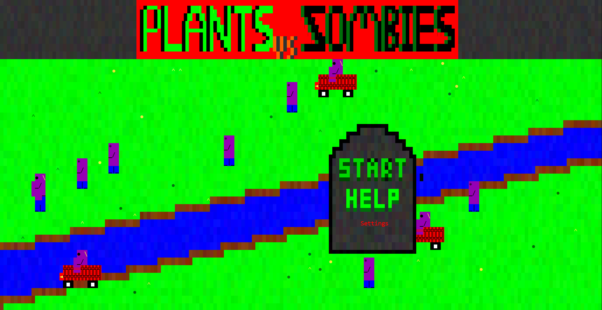
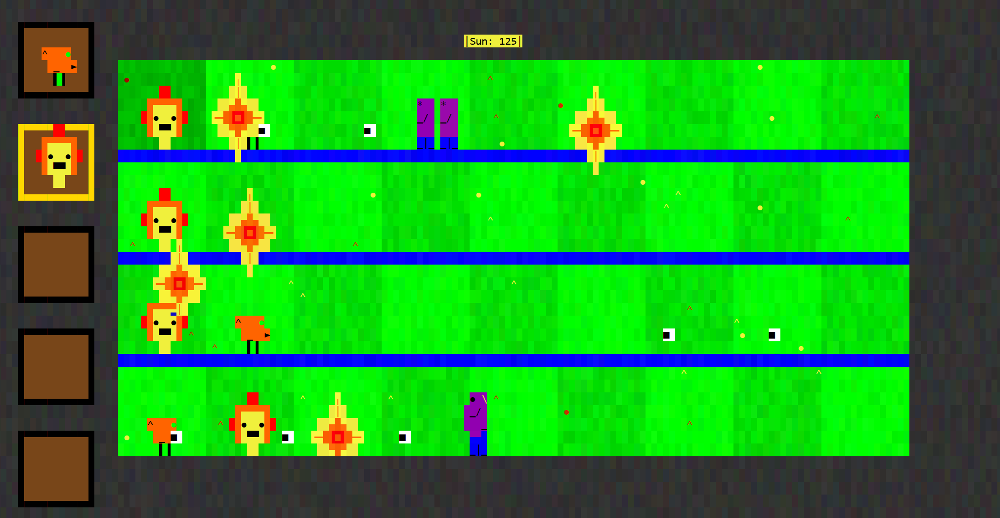

# PlantsVSZombies
A recreation of Plants vs. Zombies, running entirely in the console, using text characters as pixels. This project was initially created as a school assignment and later refined with bug fixes and improved user interaction, and a full refactor of the program’s internal structure to improve readability and program flow.

Controls:
    Arrow Keys: Move the game cursor

    Enter: Activate the object your cursor is on (e.g. place a plant)

    Escape: Open or close the settings menu

    Mouse is not supported: Clicking the console window may cause display issues due to Console.Write() usage

Requirements
    .NET 8.0 or later

    Windows 10 or newer
    Should also work on Linux/macOS, though this hasn't been fully tested.

    No additional setup required — just build and run the project.

The Main Menue

What a Level looks like
